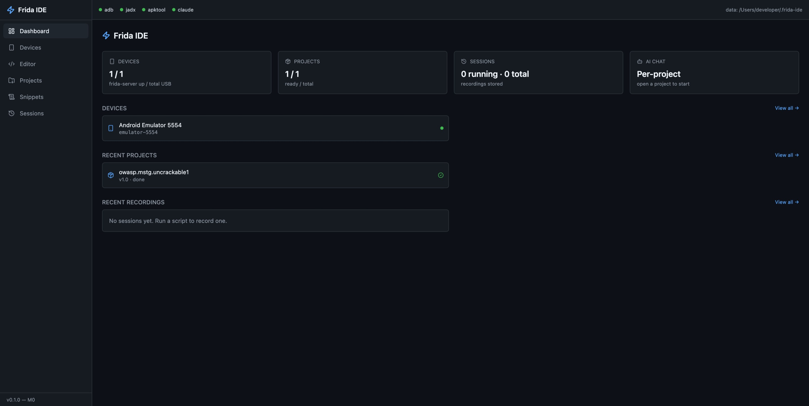
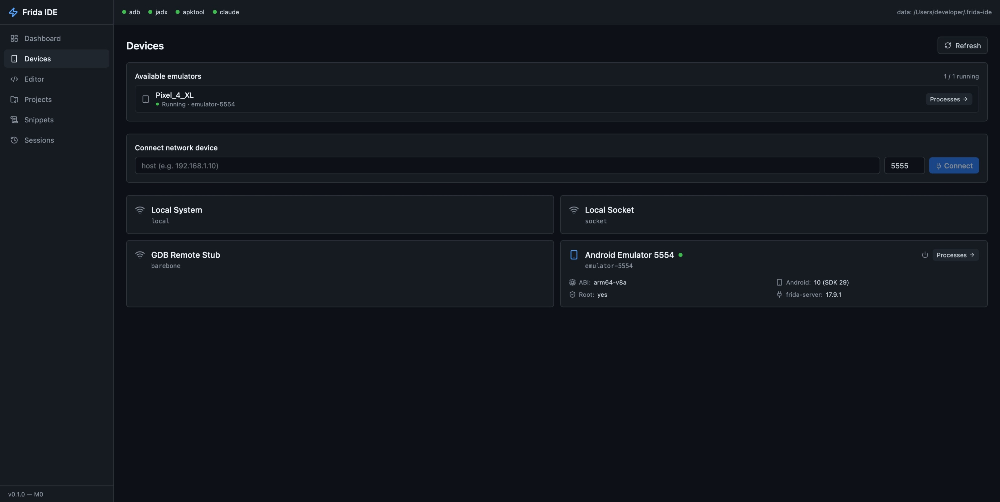
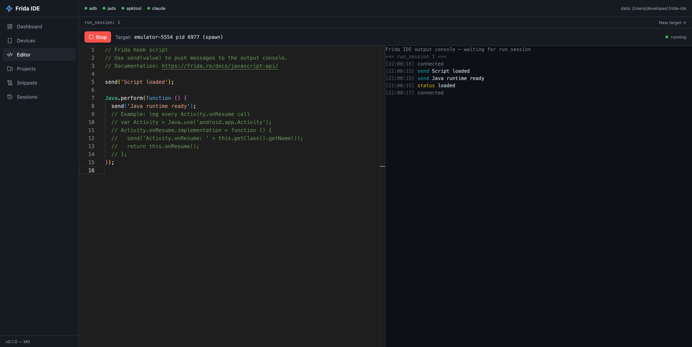
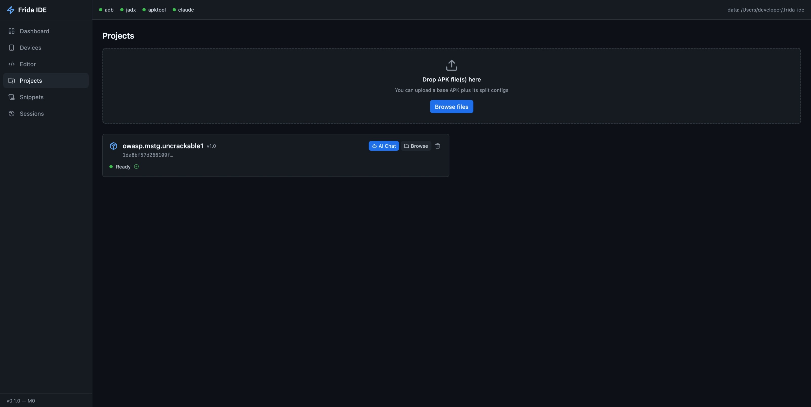
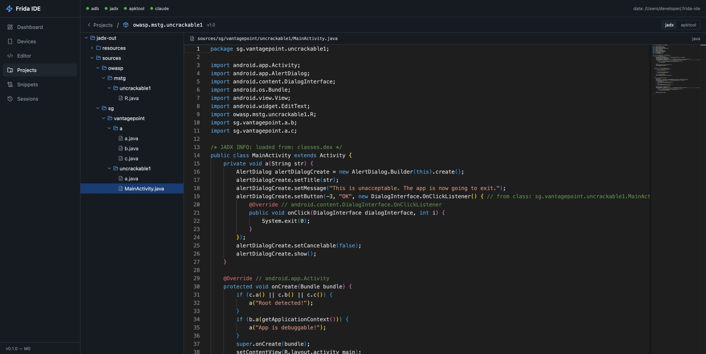
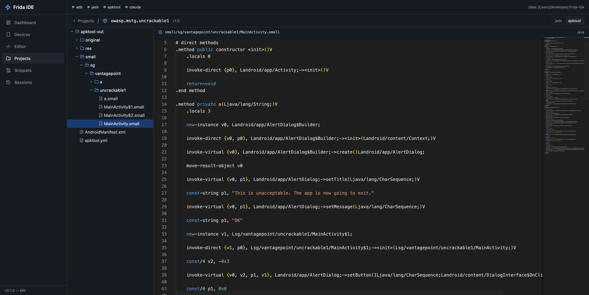
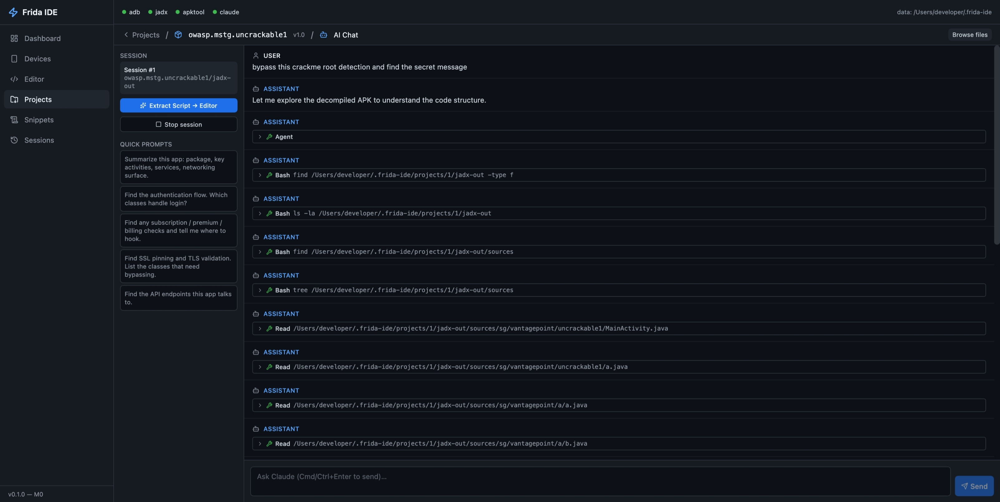
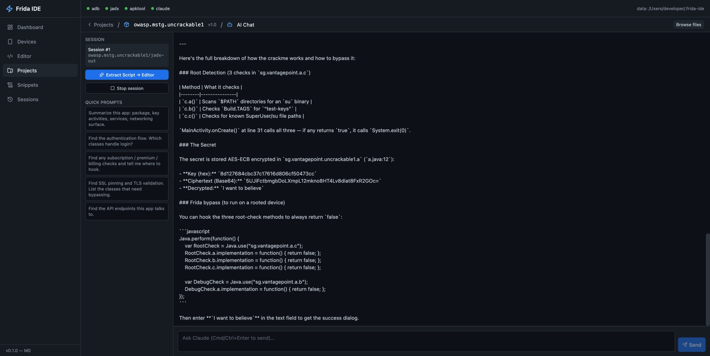
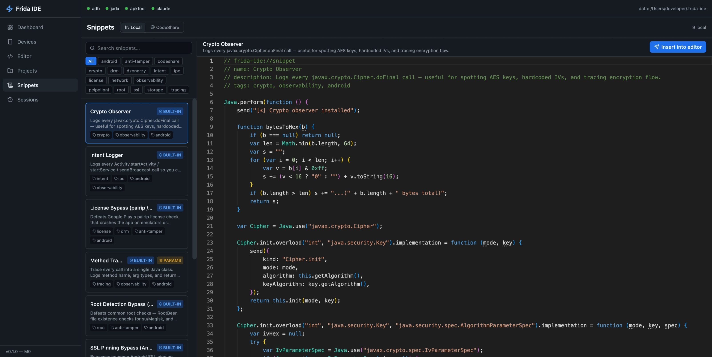
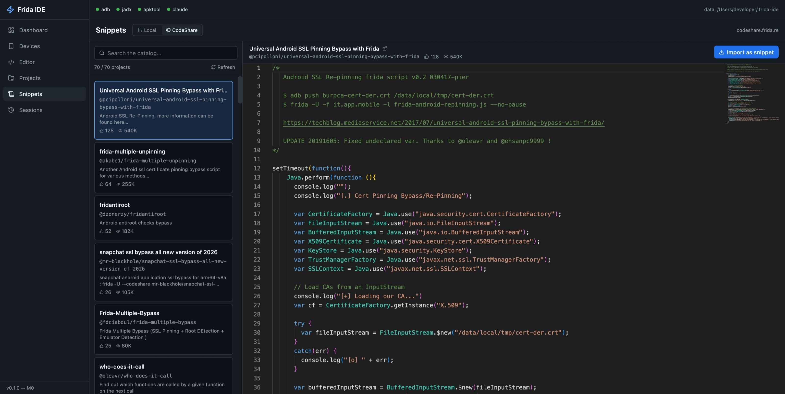

# Frida IDE

A web-based IDE for [Frida](https://frida.re/) with an integrated AI assistant powered by [Claude Code](https://docs.claude.com/en/docs/claude-code/overview). It collapses the usual *terminal soup* — `adb`, `frida-server`, `frida` CLI, `apktool`, `jadx`, and a separate AI chat — into a single browser tab.

> **Status:** active development. The full M0–M5 milestone set in [`backend/`](backend/) and [`frontend/`](frontend/) is wired up: device management, APK pipeline, Monaco editor, live `send()` console, AI chat, codeshare browser, emulator launcher, and session recording.

---

## What it does

| Pain point | What the IDE does |
|---|---|
| `adb push frida-server …` and version drift | One-click installer that downloads the matching `frida-server-<version>-<arch>.xz`, pushes it, `chmod`s it, starts it as root, and re-checks the version on every device connect |
| Forgetting to start `frida-server` | A background watcher polls every 10 s and auto-restarts it on failure |
| Picking the right `device.spawn` arguments | Inline app/process picker on the Editor tab — search by name or package, click **Spawn** or **Attach**. Last target is persisted so repeat Runs skip the re-pick |
| Spawn-time injector bugs (`unable to pick a payload base`) | Falls back to `monkey -p <pkg> -c LAUNCHER 1` + attach when `device.spawn` raises this Frida-side error |
| Java/ObjC/Swift bridges missing in Frida 17 | The IDE injects the same lazy bridge loader the `frida` CLI uses, so `Java.perform(...)` works out of the box |
| `apktool` + `jadx` orchestration | Drop an APK on the Projects tab, watch the pipeline progress over WebSocket, then browse the decompiled tree |
| Iterating on a hook across many files | Multi-file Monaco editor with per-tab Run button. Tabs persist to `localStorage`, double-click to rename, close/reopen survives reloads |
| Flipping between a shell and the IDE | **Persistent bottom console** — a real PTY (your login shell) mounted at the Layout level. `Ctrl/Cmd+\`` to toggle, drag the top edge to resize; closed state hides via CSS so the shell + history survive toggles |
| Pulling an app off a device to reverse it | **Pull APK** button next to every app in the process list. Handles split APKs (`pm path` + `adb pull` of every slice), drops them under `~/.frida-ide/pulled/<serial>/<pkg>/`, then shows an **Open in new project** action on the success toast that decompiles them into a fresh project in one click |
| Switching between AI chat and the editor | Per-project Claude session, scoped `cwd` to the decompiled tree, streamed via stream-json. **Extract Script** reads the canonical file from disk (so iterative `Write → Edit → Edit` lands the full current script, not a patch fragment) |
| Reusable hook libraries | First-boot seeded snippet library (SSL pinning bypass, root-detection bypass, intent logger, crypto observer, method tracer, …) plus a [codeshare.frida.re](https://codeshare.frida.re/) browser with one-click import |
| Lost output on reconnect | All WebSocket topics back onto a 10k-event ring buffer with `last_event_id` replay, and `ws.send_json` is serialised behind an asyncio lock so the pump + heartbeat can't race on a single socket |
| Finding what's running right now | Top bar **Projects** chip lists every project with its pipeline-status badge; **Sessions** chip pulses green when at least one Frida run is active and lists them with mode icon + target + elapsed time — click to jump straight into the live editor |
| Multiple devices in parallel | Multi-device dashboard + per-device process listing |

---

## Architecture

```
                ┌─────────────────────────────────────────┐
   Browser      │  React + Vite + Monaco + xterm.js       │
   (port 5173)  │   /devices  /editor  /projects  /ai …   │
                └────────────────┬────────────────────────┘
                                 │  REST + WebSocket
                ┌────────────────┴────────────────────────┐
                │  FastAPI + uvicorn (port 8765)          │
                │                                         │
                │  routers:                               │
                │    devices  processes  scripts          │
                │    snippets projects   files            │
                │    ai       sessions   ws               │
                │    codeshare emulators  tty             │
                │                                         │
                │  services:                              │
   Frida ─────► │    frida_manager   frida_server         │
   (frida-core) │    adb             apk_pipeline         │
   subprocess   │    claude_runner   session_recorder     │
                │    pubsub          device_watcher       │
                │                                         │
                └──┬──────────────────────────────┬───────┘
                   │                              │
            ┌──────┴──────┐              ┌────────┴────────┐
            │ SQLite WAL  │              │  ~/.frida-ide/  │
            │ workbench.db│              │   projects/     │
            └─────────────┘              │   frida-server- │
                                         │    cache/       │
                                         └─────────────────┘
```

| Layer | Stack |
|---|---|
| Backend | Python 3.11+ · FastAPI · uvicorn · `frida` (pinned) · sqlmodel · asyncio + WebSockets |
| Frontend | React 19 · TypeScript · Vite · TailwindCSS · shadcn/ui · Monaco Editor · xterm.js · TanStack Query · Zustand |
| AI | `claude` CLI as subprocess in `--input-format=stream-json --output-format=stream-json --print` mode, `cwd` = the project's decompiled tree |
| Persistence | SQLite (WAL) at `~/.frida-ide/workbench.db` |

The trickiest part of the backend is the **Frida → asyncio bridge** in `services/frida_manager.py`. Frida's `script.on('message', cb)` callback runs on a private thread; every cross-thread publish goes through `loop.call_soon_threadsafe(pubsub.publish_nowait, …)` so the FastAPI loop is the only writer to the WebSocket queues. Blocking Frida calls (`enumerate_processes`, `attach`, `spawn`, …) are wrapped in `asyncio.to_thread`.

---

## Requirements

All of these are looked up via `$PATH` (or an explicit `FRIDA_IDE_*` env var — see **Configuration** below). The IDE degrades gracefully when optional tools are missing: the tab that needs them shows a red banner instead of crashing.

### Required to run the IDE

| Tool | Tested version | Purpose |
|---|---|---|
| **Python** | 3.11 – 3.13 | Backend runtime. Declared in `pyproject.toml`. |
| **Node** | 20 LTS or newer | Frontend build + dev server. |
| **pnpm** | 9.x | Frontend package manager. `corepack enable` is the easiest way on Node 20+. |
| **`adb`** | Platform Tools 34+ | Device management. Autodetected at `~/Library/Android/sdk/platform-tools/adb` (macOS) and `~/Android/Sdk/platform-tools/adb` (Linux). |

### Required for specific tabs

| Tool | Tab / feature | Notes |
|---|---|---|
| Android **device or emulator** reachable via `adb devices` | Devices, Editor, Sessions, Pull APK | USB (`adb`) or TCP (`adb connect host:port`). Emulators from Android Studio work out of the box. |
| **`frida-server`** on the device | every Frida feature | Installed for you by the Devices tab's **Install frida-server** button — it downloads the binary matching the Python `frida` package pinned in `pyproject.toml` (currently 17.9.1), pushes it, and starts it as root. |
| **`apktool`** | APK pipeline (Projects tab) | Install via Homebrew (`brew install apktool`), `sdkman`, or place the `apktool` wrapper + `apktool_*.jar` on your `$PATH`. Requires a JDK. |
| **`jadx`** | APK pipeline (Projects tab) | `brew install jadx`, or download a release and put `jadx` / `jadx-cli` on `$PATH`. |
| **`claude`** CLI | AI Chat tab | [Claude Code](https://docs.claude.com/en/docs/claude-code/overview) — `npm install -g @anthropic-ai/claude-code` and sign in. The IDE spawns it as a subprocess with `--output-format=stream-json`. |
| **Android `emulator` + `avdmanager`** | Emulators tab | Shipped with the Android SDK `emulator` package. The tab lists AVDs via `emulator -list-avds` and launches them with `adb emu avd name`. |
| **Java** (JDK 17+) | transitively required by `apktool` and `jadx` | Any distribution works. `apktool` in particular needs a JDK, not just a JRE. |

### Supported host OSes

- **macOS** (Apple Silicon + Intel) — primary dev platform, the bottom PTY console uses `pty.fork()` which needs `os.fork()` so **Windows is not supported natively** (use WSL 2).
- **Linux** — works. Stock `bash` / `zsh` login shells are fine for the console.
- **Windows** — run the backend under WSL 2. The frontend works in a native browser.

### Target device support

- **Android** — arm64-v8a, armv7, x86, x86_64. The frida-server installer auto-picks the right binary based on `ro.product.cpu.abi`.
- **Emulator spawn workaround**: on older images where `device.spawn` hits `unable to pick a payload base`, the IDE falls back to `monkey -p <pkg> -c LAUNCHER 1 + attach`. Early static-initialiser hooks are missed in that mode but every Activity/runtime hook works.
- **iOS** — not wired up in the UI yet. The underlying `frida` Python binding supports it, but there's no ipa-pull / frida-server-for-jb flow in the project.

---

## Quick start (development)

Once the requirements above are in place:

```bash
git clone https://github.com/MrOplus/frida-ide.git
cd frida-ide

# Backend
python3.11 -m venv .venv
source .venv/bin/activate
pip install -e ".[dev]"

# Frontend
pnpm --dir frontend install

# Run both with hot reload
./scripts/dev.sh
```

Then open <http://127.0.0.1:5173>.

The first time you connect a device, the watcher will detect that `frida-server` isn't running and offer to install it for you (or auto-install silently — you'll see the status dot flip green within a few seconds).

### Packaged install

```bash
pnpm --dir frontend build      # bake the SPA into frontend/dist/
pip install .                  # the wheel includes frontend/dist/ via hatch force-include
frida-ide                      # console entry point — serves API + SPA on :8765
```

---

## End-to-end walkthrough

1. **Devices tab** — your phone/emulator appears with ABI, Android version, root status, and `frida-server` health. Hit **Install frida-server** if needed. The top bar has tool-status dots for `adb` / `apktool` / `jadx` / `claude` so you can see at a glance what's wired up.
2. **Projects tab** — drag-and-drop an APK, or hit **Pull APK** on an app row in the Processes tab and then click **Open in new project** on the success toast. Either way you'll see `queued → apktool → jadx → done` stream over the project's pipeline WebSocket.
3. **Project files** — browse the decompiled `sources/` tree with syntax highlighting.
4. **AI Chat** — start a Claude session scoped to the project's decompiled tree. Ask things like *"Find the authentication flow"* or *"Hook all Log.d calls and print tag+message"*. Tool calls (Read, Grep, Glob, Write, Edit) stream live in the chat pane; thinking blocks render as `(thinking) …` prefixed turns so you can see reasoning.
5. **Extract Script → Editor** — reads the current file from disk for whichever `.js` path Claude most recently touched via Write/Edit/MultiEdit. This means iterative edits always give you the full canonical script, not a patch fragment. Opens as a fresh tab in the Editor.
6. **Editor tab** — **multi-file Monaco** with a tab strip: double-click to rename, middle-click or X to close, open/active state persisted to `localStorage`. Pick a target inline (device dropdown + app search + Spawn/Attach). The last target sticks so subsequent Runs skip the picker. Hitting **Run** stops the previously-active run_session automatically — no zombie sessions.
7. **Spawn / Attach** — script loads, `send()` messages stream into the xterm console next to the editor. If `device.spawn` hits the `unable to pick a payload base` bug on older emulator images, the IDE automatically falls back to `monkey … LAUNCHER 1` + attach.
8. **Bottom console** — `Ctrl/Cmd+\`` pops a real login shell at the bottom of the window (a `pty.fork`'d child of the backend). Drag the top edge to resize; closing the drawer hides it via CSS but the shell stays alive. Great for one-off `adb logcat`, editing the pulled APKs, or tailing files.
9. **TopBar menus** — the **Projects** chip lists every project with its current pipeline status; click to jump to its files. The **Sessions** chip pulses when a Frida run is active and lets you jump straight back into the live editor for any running session.
10. **Sessions tab** — every run is recorded with all its `send()` / error / status events; export the JSON for replay or sharing.

---

## API surface

```
GET    /api/devices                                       Frida + ADB merged
POST   /api/devices/connect                               adb connect host:port
POST   /api/devices/{serial}/frida-server/install         download → push → start
POST   /api/devices/{serial}/frida-server/{start,stop}
GET    /api/devices/{serial}/frida-server/status

GET    /api/devices/{serial}/processes                    sorted like frida-ps -U + icons
GET    /api/devices/{serial}/apps                         sorted like frida-ps -Uai + icons
POST   /api/devices/{serial}/spawn / attach / kill
POST   /api/devices/{serial}/apps/{identifier}/pull       pm path + adb pull → ~/.frida-ide/pulled/

GET    /api/emulators                                     AVD list
POST   /api/emulators/{name}/start

CRUD   /api/scripts
POST   /api/scripts/run                                   {device, target, mode, source} → run_session_id
POST   /api/scripts/{id}/stop

CRUD   /api/snippets
POST   /api/snippets/{id}/render                          template parameters

POST   /api/projects                                      multipart APK upload
POST   /api/projects/from-pulled/{serial}/{identifier}    new project from a previously-pulled APK
GET    /api/projects, /api/projects/{id}
GET    /api/projects/{id}/tree?path=
GET    /api/projects/{id}/file?path=

POST   /api/projects/{id}/ai/session                      spawn claude in decompiled tree
POST   /api/projects/{id}/ai/session/{sid}/message
POST   /api/projects/{id}/ai/session/{sid}/extract-script
GET    /api/projects/{id}/ai/session/{sid}/messages       persistent backfill
DELETE /api/projects/{id}/ai/session/{sid}

GET    /api/codeshare/browse                              scrape codeshare.frida.re catalog
POST   /api/codeshare/import                              one-click import to local snippets

GET    /api/sessions, /api/sessions/{id}/events, /api/sessions/{id}/export
```

### WebSocket topics

```
/ws/devices                              device add/remove, frida-server status
/ws/run/{run_session_id}                 stdout/stderr/send/error from active script
/ws/ai/{ai_session_id}                   Claude stream-json events
/ws/projects/{project_id}/pipeline       apktool/jadx progress
/ws/tty                                  bottom-drawer login shell (pty.fork)
```

Envelope for the pubsub-backed topics: `{type, ts, payload, event_id}`. Reconnect with `?last_event_id=N` to replay buffered events with id > N from the per-topic 10k-line ring buffer. All sends on the server go through an `asyncio.Lock` so the pump task and the heartbeat loop can't interleave wire frames.

`/ws/tty` is its own shape — it forwards `{type: "data", data: "<base64>"}` bytes both ways plus `{type: "resize", cols, rows}` frames for `TIOCSWINSZ`. One PTY is forked per connection.

---

## Built-in snippets

Seeded into the SQLite snippet table on first boot from `backend/app/builtins/snippets/`:

- `ssl_pinning_bypass.js` — universal Android SSL pinning bypass (OkHttp, TrustManager, Conscrypt, …)
- `root_detection_bypass.js` — common root-check overrides (`RootBeer`, `getprop`, file existence, `su` lookup)
- `license_bypass_pairip.js` — PairIP license-check no-op
- `intent_logger.js` — every `startActivity` / `sendBroadcast` with extras
- `sharedprefs_logger.js` — every `SharedPreferences.get*` and `put*`
- `crypto_observer.js` — `Cipher.doFinal`, `MessageDigest.digest`, `Mac.doFinal` payloads
- `method_tracer.js` — generic class+method tracer with templated parameters

The codeshare browser tab supplements these with the full [codeshare.frida.re](https://codeshare.frida.re/browse) catalog, importable in one click.

---

## Configuration

Runtime data lives under `~/.frida-ide/` (created on first run):

```
~/.frida-ide/
├── workbench.db                            # SQLite (WAL mode)
├── workbench.db-{wal,shm}
├── projects/<id>/
│   ├── apk/base.apk                        # + split_*.apk on multi-APK installs
│   ├── apktool-out/
│   ├── jadx-out/
│   └── meta.json
├── pulled/<serial>/<pkg>/                  # staging for "Pull APK" results
│   └── *.apk                               # wiped + re-filled on every pull
├── frida-server-cache/<version>/<arch>/
│   └── frida-server                        # decompressed binary
└── logs/
```

Environment variables (all optional, see `backend/app/config.py` and `backend/app/utils/paths.py`):

| Var | Default | Purpose |
|---|---|---|
| `FRIDA_IDE_HOST` | `127.0.0.1` | Bind host. Setting this to `0.0.0.0` requires `FRIDA_IDE_UNSAFE_EXPOSE=1` (red banner in UI). |
| `FRIDA_IDE_PORT` | `8765` | API + SPA port. |
| `FRIDA_IDE_DATA_DIR` | `~/.frida-ide` | Override the data root. |
| `FRIDA_IDE_ADB` | autodetect | Path to `adb`. |
| `FRIDA_IDE_APKTOOL` | autodetect | Path to `apktool`. |
| `FRIDA_IDE_JADX` | autodetect | Path to `jadx`. |
| `FRIDA_IDE_CLAUDE_BIN` | `shutil.which("claude")` | Path to the `claude` CLI for the AI tab. |

Discovery order for ADB / jadx / apktool / claude: explicit env var → `$PATH` → standard SDK locations (e.g. `~/Library/Android/sdk/platform-tools/adb` on macOS, `~/Android/Sdk/platform-tools/adb` on Linux).

---

## Repository layout

```
frida-ide/
├── pyproject.toml
├── scripts/dev.sh                  # uvicorn + vite hot-reload runner
├── _screenshots/                   # docs images referenced below
├── backend/
│   ├── app/
│   │   ├── main.py                 # FastAPI factory + lifespan
│   │   ├── config.py               # pydantic-settings
│   │   ├── db.py                   # SQLModel engine, WAL pragma
│   │   ├── models/                 # project, script, snippet, run_session, hook_event, ai_session, ai_message
│   │   ├── routers/                # devices, processes, scripts, snippets, projects, files, ai, sessions, ws, codeshare, emulators, tty
│   │   ├── services/
│   │   │   ├── frida_manager.py    # ★ Frida ↔ asyncio bridge, spawn/attach/load
│   │   │   ├── frida_server.py     # ★ download → push → start, version sync
│   │   │   ├── apk_pipeline.py     # apktool + jadx orchestration
│   │   │   ├── claude_runner.py    # ★ stream-json subprocess pump
│   │   │   ├── session_recorder.py
│   │   │   ├── device_watcher.py   # background frida-server health loop
│   │   │   ├── codeshare.py
│   │   │   ├── emulator.py         # avdmanager + emulator -avd
│   │   │   ├── snippet_loader.py   # seed builtins on first boot
│   │   │   └── pubsub.py           # in-process topic broker + ring buffer
│   │   ├── builtins/snippets/      # seeded JS hooks
│   │   └── utils/{paths,arch}.py
│   └── tests/
└── frontend/
    └── src/
        ├── routes/                 # Dashboard, Devices, Editor, Processes, Projects, ProjectFiles, ProjectAi, Snippets, Sessions
        ├── components/
        │   ├── layout/             # Sidebar, TopBar, TopBarMenus, BottomConsole, Toaster
        │   ├── devices/            # DeviceCard, FridaServerControls
        │   ├── editor/             # MonacoPane, RunControls, OutputConsole, SnippetPicker
        │   ├── projects/           # ApkUpload, FileTree, FileViewer
        │   ├── ai/                 # ChatPane, ChatMessage, streamReducer
        │   └── snippets/           # SnippetCard, CodeshareBrowser
        ├── lib/{api.ts, ws.ts, utils.ts}
        └── store/
            ├── editorStore.ts      # multi-file tabs, pendingRun, lastTarget, activeRunSessionId
            ├── uiStore.ts          # bottom-console open/height (persisted)
            └── toastStore.ts       # imperative toast.success/error/info + action buttons
```

---

## Screenshots

| | |
|---|---|
|  |  |
| **Dashboard** — top bar with tool-status dots, Projects + Sessions quick-access menus. | **Devices** — ABI / Android version / root / frida-server health per device. |
|  |  |
| **Editor** — multi-file Monaco with inline target picker and live xterm output. | **Projects** — APK drop zone and pipeline status. |
|  |  |
| **jadx-decompiled Java** rendered from the project tree. | **apktool Smali** view for the same project. |
|  |  |
| **AI Chat** scoped to the decompiled tree with streamed tool calls. | **Extract Script → Editor** lands the full on-disk hook. |
|  |  |
| **Snippet library** seeded on first boot. | **codeshare.frida.re browser** with one-click import. |

---

## Security notes

- Bound to `127.0.0.1` by default. Exposing on `0.0.0.0` is gated behind `FRIDA_IDE_UNSAFE_EXPOSE=1` and shows a red banner in the UI.
- All subprocesses are launched with `create_subprocess_exec(...)` and **argv arrays** — never shell strings. Device serials are validated against `^[A-Za-z0-9:._-]+$`. Android package identifiers are validated against a strict `^[A-Za-z][A-Za-z0-9_]*(?:\.[A-Za-z0-9_]+)+$` regex before any `adb pull` / `pm path` call.
- APK uploads are size-capped (500 MB) and project names are sanitised against path traversal.
- **Extract-script disk read** and **project-from-pulled** both resolve their source path with `Path.resolve()` + `Path.relative_to()` against their respective roots (`projects/<id>/` and `pulled/`), so a crafted tool-use or request can't escape via `../` or a symlink.
- **The Claude subprocess inherits your user's permissions and has full filesystem access.** Tool calls (Read / Write / Edit / Bash) are surfaced in the chat sidebar so you can see what it's touching.
- **Editor scripts run inside the *target process* via Frida**, not on the host. There is no `eval` path on the backend itself.
- **The bottom console is a real login shell** with full user permissions. Because the IDE is bound to localhost by default it's equivalent to opening a terminal tab, but **never run the IDE with `FRIDA_IDE_UNSAFE_EXPOSE=1` on a shared machine** — that would expose `/ws/tty` to the network.

---

## Tests + lint

```bash
.venv/bin/python -m pytest backend/tests/ -q
.venv/bin/ruff check backend/
pnpm --dir frontend tsc --noEmit
```

---

## License

MIT — see [`pyproject.toml`](pyproject.toml).
